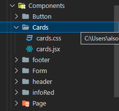
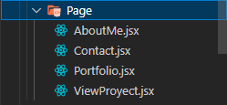

<h1>Folder structuring</h1>

# The best way to structure this project was to create a folder called "Components" and inside it create child folders that will contain the components and their respective css files to style the components.

 

### PAGE

# The "PAGE" folder will contain the components that the routes that will be handled in the project for the page jumps to make the navigation of the page more fluid and not have the problem of reloading the web page constantly. 

 